# Database Information Retrieval

## Introduction

I introduced the concept of academic or bibliographic databases in [section 3.1](3a-information-sources-resources.html).
These databases offer a number of unique advantages over search engines, and some disadvantages, too.
The main advantages are that databases offer specialized, extensive collections on a variety of topics.
Furthermore, these collections are usually invisible to search engines,
which means that if we use the web only, we miss out on important information.
Another advantage is that they provide greater control over the search process.
The main disadvantages are they require more time to learn to use them well,
there are many databases to choose from (and to find),
they have their own user interfaces, which requires additional learning, and they are often only accessible via a library.

> Many databases are only accessible via a library because a library pays to use them.
> Google and other search engines operate on different revenue models, like serving ads,
> to pay for locating **free** content on the web.
> Google and other search engines do not provide access to **non-free** content on the web.

Information retrieval (search) in databases works similarly and differently than it does with the web.
Like with the web, database information retrieval works on **documents** in a **corpus**.
We search that corpus using queries, and how we construct our queries is important.

Documents in databases though are a bit different.
As discussed in the previous section, websites exist in a fairly organized hierarchy (with respect to top level domains, etc.),
but web pages themselves are not always very structured.
Instead, search engines have become really good at making sense of unstructured text.

Academic databases, on the other hand, generally work with fairly structured documents;
that is, they index structured bibliographic records, like the one in Figure 1.
While they may also index full text documents if those documents are accessible to the database,
the focus is based on bibliographic records.
If only bibliographic records are indexed, the database is usually called an **abstract and indexing database (A&I database)**.
Otherwise it's called a **full text database** if it provides access to the full text of information sources.
Many of the databases that we have access to at our university library are a mix of the two.

<figure>
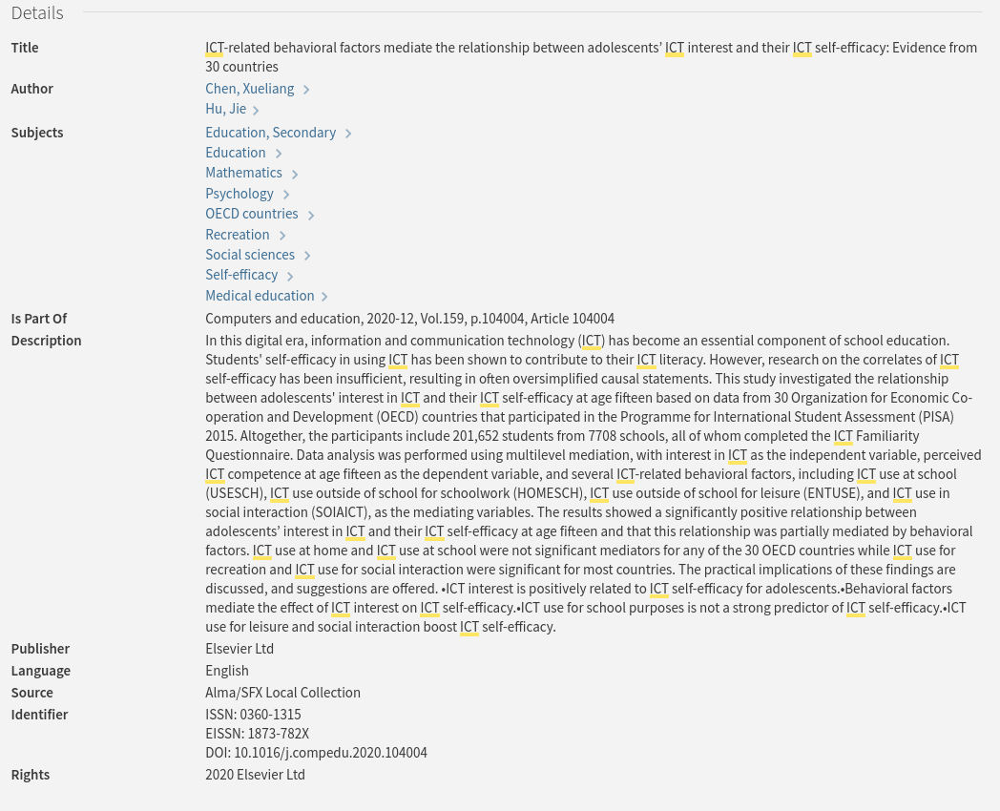
<figcaption>Fig. 1: Bibliographic Record in InfoKat. When we search InfoKat, we specifically search these kinds of fields in what is called "fielded search."</figcaption>
</figure>

## Searching Bibliographic Records

Bibliographic information is also called **metadata**.
Bibliographic records are metadata **about** specific items (books, articles, photos, etc.) in a bibliographic or academic database.
Metadata is broadly defined as **data about data**, or sometimes as information about information.
For example, a **title** of a book is metadata about the name of a book.
The **author** name of a journal article is metadata about the author of a journal article.
And so forth.
The complete metadata about a specific item such as a book or journal article is a **record**.
In a database, this metadata is created by professionals and is well structured, as illustrated in Figure 1 above.
As searchers, this means that there are pre-set fields that we can search in academic databases and that
these pre-set fields specifically search the corresponding metadata.
For example, in [Academic Search Complete (ASC)][asc], records are described with the following metadata, and
this means we can search ASC using this metadata.
This kind of structured, field-specific searching is known as **fielded search**, and
it's one of the most powerful features of academic databases.

- Author
- Title
- Subject Terms
- Abstract text
- Author supplied keywords
- Geographic terms
- People (names)
- Journal Name
- ISBN
- And more.

We can also use metadata to filter search results by publication date, full text availability,
document type, language, number of pages, and images (depending on the database and its content).
In the end, this means we have greater control over the search process than we do in a search engine 
because the corpus is better defined.

In the previous section on web information retrieval, I showed how we can search the web
using the `:filetype` operator to limit results to PDFs, DOCX, XLSX, etc files.
In a bibliographic database like *ASC*, we can limit results by **document type** instead.
That means we can restrict results to document types like:

- articles
- bibliographies
- book chapters
- book reviews
- case studies
- editorials
- film reviews
- interviews
- letters
- obituaries
- opinions
- poems
- recipes

And much more.

Otherwise, all the same principles apply to searching databases as searching the web with a search engine.
Specifically:

1. Document-centered (bibliographic records are documents)
2. Documents exist within a corpus
3. Query construction is important

And many of the same techniques apply, too:

1. We can use **quoting** to make sure words are included in the results.
2. Term order matters.
3. We can use **OR** between terms to focus on one term or the other or both.
4. We can use other operators, like **NOT** to exclude documents that contain specific terms,
just like we can use the minus sign to exclude terms in search engines;
and we can use the **AND** operator to force return documents that contain all terms in our query.

> The **AND** operator between two query terms means that both terms must be present in each search result.
> For example, if I search for `dogs AND cats` in a database like *ASC*,
> then each result must include both the terms **dogs** and **cats**.
> We usually have to specify the **AND** in a database.
> However, in search engines, the **AND** is assumed between terms.
> So the equivalent search in, for example, > Google, Bing, and DuckDuckGo is simply `dogs cats`.

## Subject Terms and Thesauri

Many (but not all) databases offer the ability to search by subject or thesauri term.
Subject/thesauri terms are types of controlled vocabulary.
They are special keywords assigned to bibliographic records and are used to capture the main topics of a document.
If a database uses these kinds of vocabulary terms, it means that each record in the database includes a list of
these terms that should well describe the contents of the items it describes.
Further, this means that all bibliographic records that share a specific subject term are linked together.

For example, the *ASC* database uses **subject terms**.
One subject term is **Forest animals**, and if I use that as my search query, then each record that is returned
must include that subject term, and that record should match the contents of the item.
I can peruse the results and identify other subject terms that help narrow my results.
For example, the subject term **BIRD habitats** appears in records with the subject term **Forest animals**,
since records often have multiple subject terms.
If I combine those terms with an **AND** operator, then I narrow my results down to two journal articles, which is pretty precise.
*ASC* is a multi-disciplinary database, and so feel free to explore subject terms related to your own interests.

<figure>
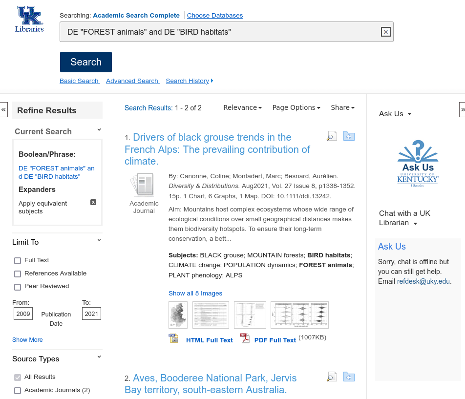
<figcaption>Fig. 2: Academic Search Complete Results.</figcaption>
</figure>

Note that the query in Figure 2 contains additional text like: `DE "FOREST animals"`.
The `DE` is a field code that instructs the database the following term is a subject term.
You can use field codes in your queries, but this is where databases get especially complicated:
different database vendors use different field codes to refer to the same fields.
You can bypass having to learn field codes by using a databases's advanced search form.

> Subject terms, thesauri terms, controlled vocabularly, and so forth are tools that professionals,
> like librarians and information professionals, use to describe works.
> In the web information retrieval section,
> I discussed how search engines have become good at interpreting natural language queries.
> However, subject terms are generally shorter and use more formal syntax than natural language.
> This is important to know when using these terms to search academic databases.

## Browsing

Although database search can be more precise than using search engines, databases are also good for browsing.

We all browse (online, in stores, as we page through books, and so on) but as a type of search process,
browsing can be a highly useful tool when applied systematically and strategically.
The result is not simply a way to scan through search results.
Rather, the result of intentional browsing, (reading or skimming a list of titles and abstracts)
can be the accumulation of highly relevant source material, relevant to our information needs and queries.

### Browsing Strategies

Although we make a distinction between browsing and searching, it is oftentimes helpful to begin
a browsing session with a keyword search, and then use something from the search results,
something like an author's name or subject term, to find and collect related information.
We call this type of browsing **pearl growing**.

### Subject Browsing

Figure 3 is an image of the [ERIC Database][eric] search page.
*ERIC* stands for **Education Resources Information Center**.
It is provided by the U.S. Department of Education, and
it is an important access point for millions of bibliographic records to journal articles, books, research reports,
[white papers][white_papers_wiki], government and other organizational reports, and more on education related topics.

<figure>
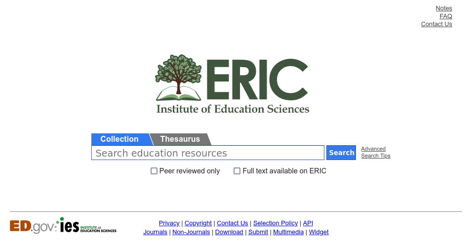
<figcaption>Fig. 3: The ERIC database</figcaption>
</figure>

*ERIC*, like other bibliographic databases, offers a thesaurus of controlled terms to help aid search.
For example, let's say I'm interested in research on academic libraries.
Figure 4 displays the page that describes the thesaurus **descriptor** for *academic libraries*.
As is usual with thesauri, it not only describes how the term is defined in the database,
but it also links to related terms, including terms that are **conceptually broader** than *academic libraries*,
**conceptually narrower** than *academic libraries*, or that are **conceptually related** to *academic libraries*.
I can click on any of these terms, and then click on the link that says to **Search collection using this descriptor**.
And in doing so, I engage in subject browsing.

<figure>
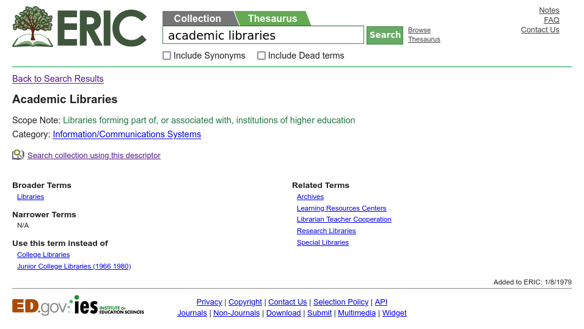
<figcaption>Fig. 4: Thesaurus descriptor page for the term academic libraries</figcaption>
</figure>

### Author Browsing

I can browse using other **access points** (a way to gain access to information) like author names.
After perusing the results from above, I can click on an author's name to narrow results.

<figure>
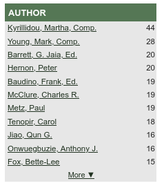
<figcaption>Fig. 5: Author names list covering academic libraries</figcaption> 
</figure>

Knowing that authors tend to write and research on specific topics (i.e., are specialists) is helpful
because I can use this information to get more source material on a topic that authors tend to write about.

### Citation Browsing

I've described abstracting & indexing (A&I) databases, but
there's another special type of A&I database called a **citation database**.
Three useful ones available to us are:

- [Scopus][scopus]
- [Web of Science][wos], and 
- [Google Scholar][GS] (more of a scholarly *search engine*).
 
The first two are available via UK Libraries, and the latter is freely available on the web.
A citation database is a database that shows who has cited an article (as known by their database)
and provides a link to those articles that have cited an article.
Citation theory says that when any two (or more) articles (or books, or other documents) are cited in this way,
they are more likely to be about the same thing.
In fact, this is how Google search works, in part.
Google's original *Page Rank Algorithm* posited that if a web page links to another web page,
then the two pages are likely to be topically related.
Because of this theory, we can follow citations to find more relevant articles.

> Quite a bit of evidence supports this theory of citations.
> However, there are also competing theories of why people cite, and there are also counterexamples to this specific idea.
> So while the assumption that citations (or links on the web) imply topical similarity is often useful, 
> it's not universally true.
> It's only *probably* true.
> Still, this assumption underlies the design of many citation-based discovery tools.

Figure 5 is a record in *Web of Science* on information literacy.
To the far right you can see that this soure item has received **4 Citations** at the time the image was captured. 
If we click on that **4 Citations** link, we can review those four citing articles or documents.
Per citation theory, it's highly probable that those four citing documents are also about information literacy;
and thus, browsing them would be of considerable help if we were interested in reading more about information literacy.

<figure>
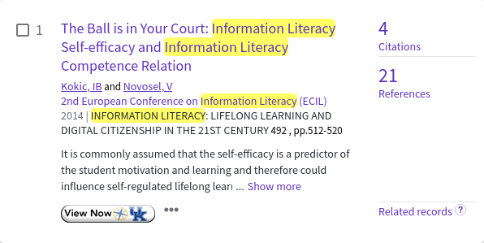
<figcaption>Fig. 6: WOS record of article on information literacy</figcaption> 
</figure>

As shown in Figure 6, after clicking on the **4 Citations** link, we can see that the term **information literacy**
appears in the title of all four citing works.
This is good evidence for citation theory, but it's also a useful trick for us.

<figure>
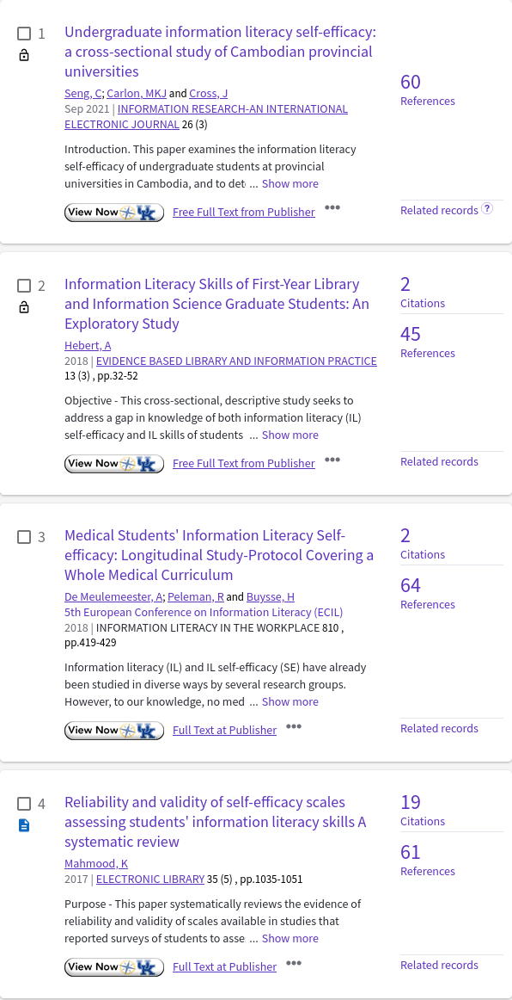
<figcaption>Fig. 7: Citing articles in WOS</figcaption> 
</figure>

*Google Scholar* works in much the same way.
Instead of *Times Cited*, it says *Cited by*, and the search results default by generally listing (we think)
the most highly cited works rather than the most recent, as is the default in *Web of Science*.
But if we click on the *Cited by* link, we'll be taken to a page that lists the citing articles and documents,
and like the *Web of Science* example, it's likely that many of the citing articles will be relevant in our search on this topic.

<figure>
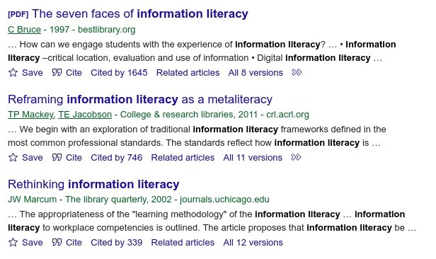
<figcaption>Fig. 8: Cited by in Google Scholar</figcaption> 
</figure>

*Google Scholar* has a larger database than either *Web of Science* or *Scopus*.
However, the latter two provide more advanced search queries, and they also allow us to browse the reference lists of sources.
These reference lists are also a way to find more relevant information on an information source's topic.

### Combination Browsing

Like with most other searches, we can combine terms and use those combinations to focus our browsing sessions.
The available combinations depend on the database we use.
Figure 9 shows an item from the *Communication & Mass Media Complete (CMMC)* database.
I searched this database using the thesauri term **DIFFUSION of innovations** AND also the term **regression** in the abstract.
Basically, this instructs the database to retrieve any record tagged with the thesauri term **DIFFUSION of innovations** and
where also the term **regression** appears in the record's abstract.
If it contains regression in the abstract, then the source likely used or refers to a statistical technique
called linear regression, logistic regression, or like.
Once I have this initial query, I can begin browsing the 11 titles and abstracts that are listed in the results.

<figure>
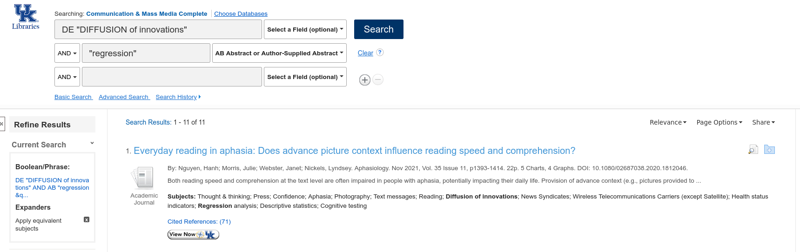
<figcaption>Fig. 9: Combination search in CMMC database">
</figure>

## Boolean Logic: AND, OR, NOT

Remember that database searching is more structured at the document level, and that this structure is reflected
in the ability to do field searches.
In Figure 9, for instance, I used two search fields.
The first field is a subject term search for the subject **DIFFUSION of innovations**,
and it's marked as a subject field with the **DE** at the beginning.
The second field is an abstract search, and this is shown in the drop down box to the right of the query term.
In between these two fields is a Boolean **AND** operator.
The AND operator tells the database that both query terms must be present in the results.
We've seen this **AND** in prior examples.

I've mentioned two other Boolean operators: **NOT** and **OR**.
Many bibliographic databases offer all three.
The **NOT** operator instructs the database to exclude the assigned term from the results.
Thus, if we had chosen **NOT "regression"**,
then the *CMMC* database would have returned results where the term **regression** does NOT appear in the abstract
for records with the subject term **DIFFUSION of innovation**.

The **OR** Boolean operator is a bit tricky.
It means, basically, *one or the other or both*.
Thus, if we had used it here, then *CMMC* would have returned all records having the subject term **DIFFUSION of innovations**,
as well as those records that did or did not have **regression** in the abstract.
The **OR** operator is more useful when querying terms in the same search fields.
For instance, we might want to use the **OR** operator to search for two different terms that might appear in the abstract fields,
or the subject term fields, such as the following related terms:

```
DIFFUSION of innovations theory" OR INFORMATION dissemination"
```

We can see how this plays out in the results.
In the first record in Figure 10, both terms appear in the subjects list.
But in the second record, only one of the terms appears since **OR** doesn't require both to appear.

<figure>
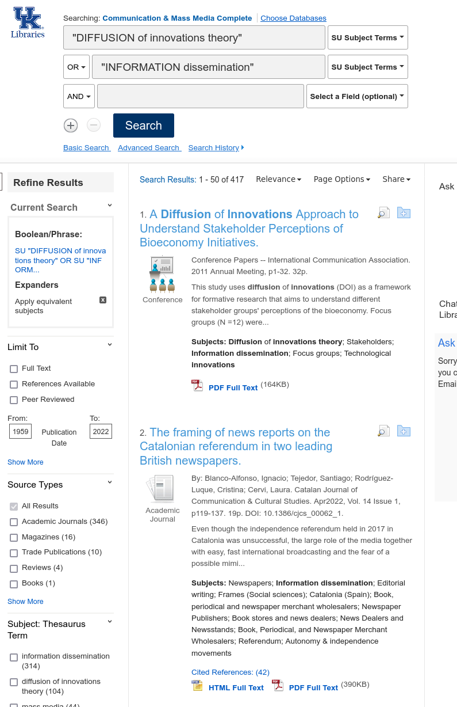
<figcaption>Fig. 10: Using the OR Boolean Operator</figcaption>
</figure>

### How to Browse

When we browse, therefore, we are attempting to locate key qualities from our results
or our initial results lists (e.g., authors, subjects, etc.).
These lists include the titles, the abstracts, the thesauri, and so forth.
And these key terms will help capture what our search is **about**.

## Developing a List

Many databases will offer a way to create, save, and export lists or individual records based on browsing and searching.
This helps us easily manage the documents that we highlight as initially important.
We can curate these lists as they grow and our search becomes more focused.

Creating a list in a specific database usually requires us to create an account on that database.
I already have an account with EBSCOhost, the vendor that provides the *CMMC* database as well as many others, and
in the Figure 11, I've already signed in to that account.
To the right of the image, you can see a folder icon.
As I browse through records that look relevant to my needs, I can click on that icon and save the result to a folder.
I can also create multiple folders and email, download, or print the records for later use.

<figure>
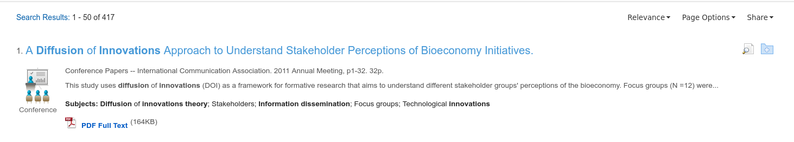
<figcaption>Fig. 11: Using Folders to Save Records</figcaption>
</figure>

Of course, I prefer to save records in Zotero rather than use a database folder or list.
This way I keep the records with me even if I lose access to the database.

## Conclusion

In this section, we learned the following:

- Databases and search engines are different
- Each have advantages and disadvantages
- Search engines are well structured at the file system level
- Databases are well structured at the record level
- Searching in a database means searching structured bibliographic records
- Records are structured by pre-set fields
- Subject terms or thesauri descriptors help create precise searches
- Systematic browsing can be a rigorous way to engage in search
- Pearl growing is a browsing strategy that involves collecting items based on an initial aspect of a bibliographic record,
  such as as:
    - subject term
    - author name
    - citation
- Because databases search structured bibliographic records with pre-set fields,
  we can create very precise queries by combining fields
- We can combine fields using Boolean logic: AND, OR, NOT
- We can create and save lists as we browse
- Or we can save items to our reference manager (RM).

In the end, don't simply browse absentmindedly.
Rather, browse with smarts: systematically and strategically.
Make the systems work for you.
And save your results in Zotero or your chosen RM as you go.

[asc]:https://libguides.uky.edu/4
[eric]:https://eric.ed.gov/
[GS]:https://scholar.google.com/
[scopus]:https://libguides.uky.edu/3347
[wos]:https://libguides.uky.edu/467
[white_papers_wiki]:https://en.wikipedia.org/wiki/White_paper
