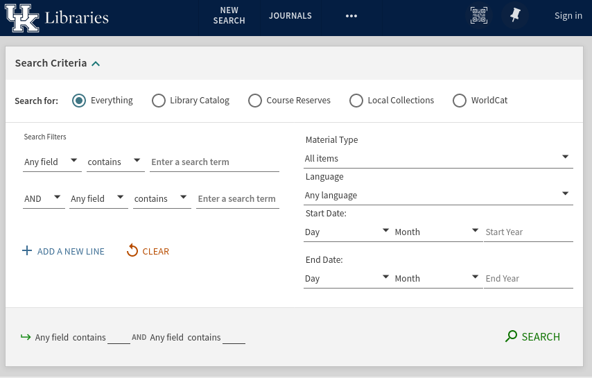
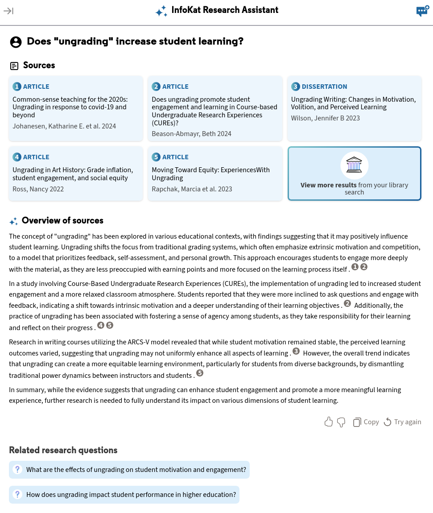
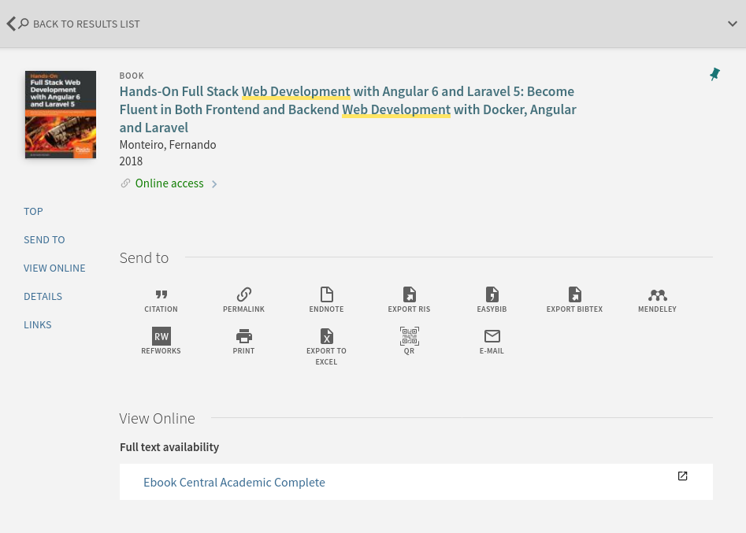

# Library Sources: Part 1

## Readings

Please review the aspects of InfoKat searching here:

- Naas, D. (n.d.). Research Guides: InfoKat Discovery: Getting Started.
  Retrieved June 26, 2025, from [UK LibGuides][infokatLibGuide].

## Introduction

We have already discussed [database information retrieval](4b-database-information-retrieval.html),
and we have also [taken an initial look](3a-information-sources-resources.html) at UK Libraries' discovery service, [InfoKat][infokat].
In this section we're going to explore a bit more the places where we can apply that knowledge.
Specifically, we will take another look at UK Libraries,
which provides access to many millions of sources that include books (ebooks and print books),
databases, journals, archival works, image collections, multimedia collections, and more.

In this and the next section, I'll focus on two of the most common usages of the library's resources:

- [InfoKat][infokat]: for searching books and also database offerings
- [Databases][uk_databases]: for searching specific database offerings 
 
However, it's worth your time to explore the UK Libraries' website in order to learn what you have access to.
Or even, you could use Google's `:site` operator to locate resources of interest that the library provides:

```
[something of interest] site:libraries.uky.edu
```

For example, let me point out that UK Libraries has multiple [Research Guides][uk_libguides]
that cover how to explore and conduct research in specific areas and domains.
The site also highlights specific librarians to contact if additional support is needed.
Here's the Research Guide for those interested or majoring in [Information Communication Technology][rg_ict].

## InfoKat

*InfoKat* is short for [InfoKat Discovery][infokat], and

> is the primary search tool for browsing and finding materials from UK Libraries' collections,
> and a great place to begin your research.
> InfoKat searches our libraries' physical holdings together with a majority of the individual databases to which we subscribe
> [About InfoKat][aboutInfokat] (this link also provides video instructions on using InfoKat).

In short, InfoKat is the modern, but more advanced, equivalent of an online card catalog system.
Not only can InfoKat locate books on the shelves at W.T. Young or at the other [library locations at UK][uklibLocations],
InfoKat is also good for discovering digital collections, database resources, and more.
And if the library doesn't have a source, InfoKat can facilitate an interlibrary loan request.
Although interlibrary loans mean that we won't get immediate access to the requested source, it's often very fast.
In my experience, I usually receive PDF copies of requested journal articles within 24 hours,
and for many books that I've requested through interlibrary loan, I generally receive copies within one to three days. 

InfoKat also works well with Zotero and other reference management software.
When you have a bibliographic record open in your browser, along with the [Zotero browser extension][zotero_browser_ext],
a small icon, representing the source type, will display in your URL bar.
See this [Zotero Research Guide][zotero_arkansas] for an illustration.

## Searching InfoKat

There are two initial ways to search InfoKat:

- [Basic search][basic_infokat]
- [Advanced search][advanced_infokat]

Basic search works just like how you would use Google or some other search engine.
You enter a query into the search box and press enter.

However, because the **corpus** you're querying is structured, as it is in a database,
it's not necessarily advisable to use *natural language* for your queries like you might in a web search engine.
Remember that our three principles of information retrieval:

- **Principle 1:** We should understand that the basic information retrieval model centers on **documents**.
  Anything indexed in a database or on the web is treated as a document.
  Documents include text, sound, images, video, etc.
- **Principle 2:** We should understand that documents do not exist independently of other documents.
  This is called the **corpus**.
  For the web, the **corpus** is organized like a **file system**, much like the file system on your personal computers.
  In a bibliographic database, the **corpus** is organized by predefined fields
  such as author names, title names, subject terms, etc.
- **Principle 3:** Our queries are not divorced from the **documents** nor the **corpus** nor
  the **organization of the corpus**.
  These things are all intertwined.
  Each time we search, search engines and databases compare **documents** in the **corpus** to each other and
  to how they are organized based on our **queries**, and
  then rank order (in some way) those documents by way of that comparison.
  Hence, when we **construct queries**, it's useful to think about the content (corpus)

Therefore, queries should always consider the corpus we're searching.
This means you should devise queries that highlight the subject matter.
You can do this by picking one or more keywords for your queries that express the topic
that you're interested in retrieving.
Also, because the InfoKat corpus you're searching is structured, advanced search offers fine-tuned,
precision search functions that let us search by specific fields, dates, and includes Boolean logic.

### Basic Search

Basic search is a great place to start your research, especially when starting on a new project.
From there you can use hints that you see in your search results to practice
[*pearl growing*](4b-database-information-retrieval.html) or to refine and narrow your search results.

<figure>

<figcaption>Fig. 1: InfoKat basic search</figcaption> 
</figure>

You can apply *pearl growing* by noticing title information, subject terms, publication information, or more
from your search results and as a way to follow up on leads/hints you find in those results.
You can also refine results by availability, resource type, subject heading, language, and more.

Like web search engines, term order matters.
Therefore, you should enclose queries in double quotes in order to force InfoKat to return results
using the exact terminology and to return results in the same order as your terms.
For example, if my query is:

```
web development
```

Then results will include titles like:

```
Development of a web tool to ...
```

But if I wrap my query in quotes, like so:


```
"web development"
```

Then results will literally reflect those terms and in that order.
For example:

```
Hands-On Full Stack Web Development with Angular...
```

### Advanced Search

Advanced search in InfoKat provides a form where you can focus on constructing precise queries.
You can apply a variety of search filters that limit queries to specific fields in the structured data,
such as title information, author/creator information, and subject terms.

<figure>

<figcaption>Fig. 2: InfoKat advanced search</figcaption> 
</figure>

Instead of using double quotes to force results to match your query, you have other options.
These include the ability to state whether the search results should contain the terms in your query,
match exactly the terms in your query, which is like using double quotes, or
whether the search results should start with the same terms as your query.

You can also use Boolean logic in advanced search.
This is especially helpful as you refine your queries.
For example, if you're interested in web development but not interested in "embedded web development",
you can use the Boolean **NOT** to removed retrieved records that contain the word "embedded" from the results.
You can also limit results by time period (publication date) in order to focus on either historical works or recent works.

If you're using Zotero and the browser add-on, you will see a folder icon in your browser bar when you're on the result page.
This will let you save multiple items to your Zotero library or to a specific Zotero folder in your library.

## Research Assistant

It should come as no surprise that InfoKat now includes AI technologies.
At the top of the InfoKat page, you'll see a link called **Research Assistant**.
This link leads to a new search interface where you can
[<q>Ask research questions. Explore new topics. Discover credible sources</q>][ra_infokat].

<figure>

<figcaption>Fig. 3: InfoKat Research Assistant</figcaption> 
</figure>

It's commonly known that AI chatbots have a tendency to *hallucinate*, as we've discussed before.
Specifically, AI chatbots tend to completely make up source information when they attempt to attribute ideas.
InfoKat's AI Research Assistant is meant to overcome this issue because it is directly connected
to the library's resources.
One of the other benefits of this technology is that Research Assistant is connected to most of the
resources provided by UK Libraries, including what's offered through the Library's numerous databases.

Figure 4 below shows the results of a research question that I've posed to InkoKat Research Assistant (RA).
Not only does RA return an overview and synthesis of the results,
it also provides direct links to actual sources that I can use in my research project.

<figure>

<figcaption>Fig. 3: InfoKat Research Assistant Results</figcaption> 
</figure>

**Be aware!**
You should still double-check all results and source information, and
in no way should you copy the text overview and use that text in-place of your own writing.

## Record Page

When you find a result that interests you, click on the link to get more information and do more with the result.
From here you can save the specific item to Zotero, but InfoKat let's you export citations manually, too.
You can have the item emailed to you, or print them out, and more.

If the item is available as a print item, InfoKat will tell you where in the library it's located
(i.e., shelf and floor), and it will also tell you which library the book is located,
since UK Libraries has many locations aside from W.T. Young.
If the item is not available electronically or in print at one of the UK Library locations,
this is where you can request the items via interlibrary loan.

When you sign in via your LinkBlue information, you can request the item directly, and if you have loans out,
you can request that they be renewed.

<figure>

<figcaption>Fig. 5: InfoKat record page</figcaption> 
</figure>

## Conclusion

UK Libraries provides access to millions of items in both digital and print versions.
In this section, I focused on accessing their collections using InfoKat Discovery,
and we focused on using Basic and Advanced Search.

It's fine to know the basics of a technology like InfoKat, but
it's another level to integrate this technology into your workflow.
In order to do that, you should use Zotero, or your reference manager of choice, to save items to you Zotero library.
As you save items, return to them, read them, and take notes on them.
This process will become streamlined and feel natural over time,
and eventually you'll have amassed your own personal knowledge repository.

In the next section, I'll focus on specific databases that UK Libraries provides access to for more topical searches.

[aboutInfokat]:https://libraries.uky.edu/find-borrow/where-do-i-start
[uklibLocations]:https://libraries.uky.edu/locations
[infokatLibGuide]:https://libguides.uky.edu/c.php?g=457383&p=3126835
[rg_ict]:https://libguides.uky.edu/ICT
[infokat]:https://saalck-uky.primo.exlibrisgroup.com/discovery/search?vid=01SAA_UKY:UKY
[uk_libguides]:https://libguides.uky.edu/home
[uk_databases]:https://libguides.uky.edu/az.php
[basic_infokat]:https://libtutorials.uky.edu/IKDoverview/
[advanced_infokat]:https://libguides.uky.edu/ikd
[zotero_browser_ext]:https://www.zotero.org/download/connectors
[zotero_arkansas]:https://uark.libguides.com/zotero/collectweb
[ra_infokat]:https://saalck-uky.primo.exlibrisgroup.com/discovery/researchAssistant?vid=01SAA_UKY:UKY
