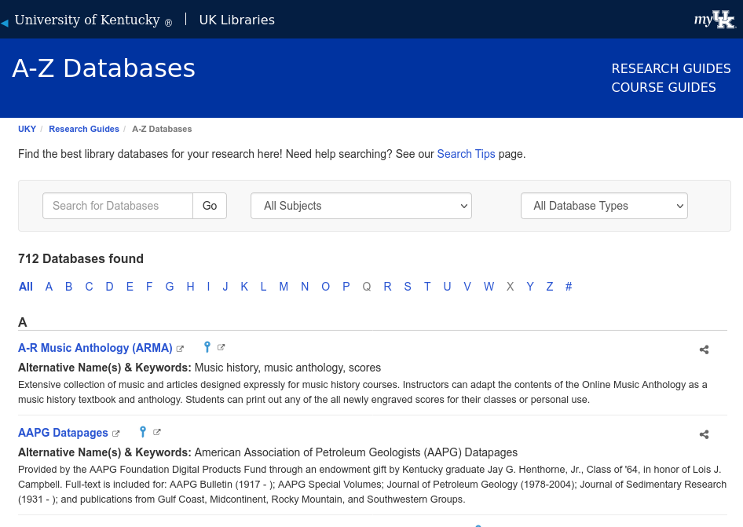
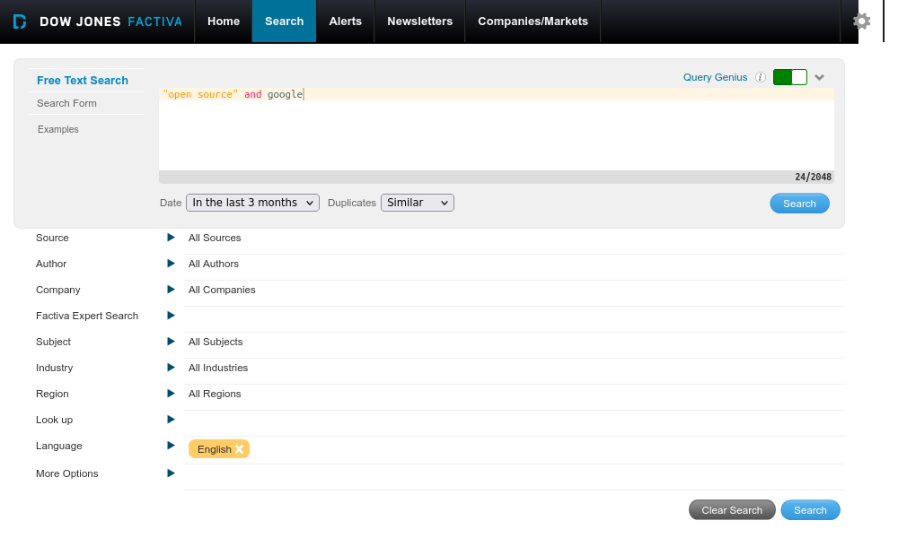
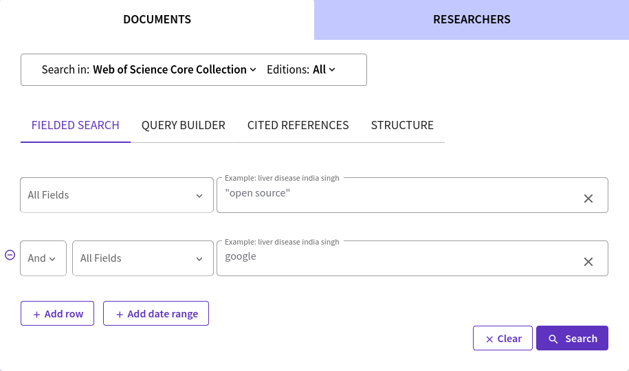
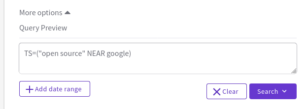
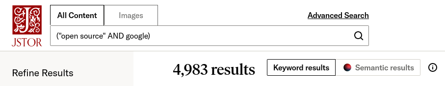

# Library Sources: Part 2

UK Libraries provides access to many millions of sources that include books (ebooks and print books),
databases, journals, archival works, image collections, multimedia collections, and more.
In the prior section, I focused on using *InfoKat* to search some of these collections.
In this section, I focus on a handful of the databases that UK Libraries offers.

I can only focus on a handful of databases because UK Libraries, as a major research institution and because of its 
large student body and wide range of majors, provides access to nearly 800 total subject databases.
Many of these databases are specialized
(e.g., African American and Africana Studies, Appalachian Studies) or cover a broad general research area (e.g., Chemistry, Education).
But a few are designed to be super broad and function as databases of databases.
I've already covered *Academic Search Ultimate* in prior sections, which is one example of a database of databases.
In this section, I'll cover another one plus some citation databases.

> Remember that if you have desktop Zotero plus the Zotero browser add-on installed,
> Zotero will automatically recognize when you have a web page open for a specific item in these databases.
> Thus, use Zotero when examining these databases to collect information on your Wikipedia topic.

While I will only cover a few databases in this section, I encourage you to explore others that are offered.
To access the databases, you can browse the list on UK Libraries' website:

[A-Z Databases][az_databases]

Besides browsing the A-Z Databases list, you can also search it using keywords, limit results to specific subject areas, and focus on *database types*.
Database types indicate something about the source.
Potential types include:

- Audio/Video
- Digitize primary sources
- E-book collections
- Government documents
- Image collections, and more.

<figure>

<figcaption>Fig. 1: A-Z Databases</figcaption> 
</figure>

## Off Campus Access

Since UK Libraries subscribes to most of the databases it offers, you have to be either on campus or sign in to use these databases.
If off-campus, signing in happens automatically when you click on a database link on the A-Z Databases page.
You will simply be prompted for your LinkBlue username and password.

You can bypass this by navigating to what's called the OpenAthens login page.
OpenAthens is basically an authenticating service.
The instructions to use it to login are provided by UK Libraries at [Access from Off Campus][off_campus_access].

## Example Databases

In the remaining part of this section,
I demonstrate a few example databases that might be of interest to you.

### Factiva

[*Factiva*][factiva] is a helpful database for locating news, market, and company information.
You can search against subjects, industries, within regions, and you can add other limits.
There are a slew of advanced search operators that help power up your search.
You can read through these operators and how to use them when searching *Factiva*:

- [Factiva Search Operators][factiva_operators]

<figure>

<figcaption>Fig. 2: Factiva Search Builder</figcaption> 
</figure>

We can try an example search.
Let's say I'm interested in any news about Google and open source software.
To search this in *Factiva*, I can approach the query like so (being sure to wrap *open source* in quotes):

```
"open source" AND google 
```

On the left side you can see a distribution of articles by date of publication, a list of relevant companies that appear
in the documents that were retrieved, as well as lists of sources, subjects, industries, languages, regions, and so forth.
We can look at the publication date distribution and note whether there are more results on a given week than on others,
and then narrow our results to a selected week.
This may help focus on hot news day for this particular topic, which may be something we want to explore. 

If I wanted to export any of these documents, I can click on specific check boxes and export the results in various ways,
either as RTF or a PDF files, or have it email the results to me or print them.

Let's go back to the search builder.
Say I found that the previous set of results were hit or miss and, as a result, I want to refine my search.
Now I can try the **adjacent operator** (`adj[N]`).
The adjacent operator tells the database to only return documents where the query terms appear within a set amount of `[N]` space between each other.
The assumption is that the closer any terms are to each other, the more likely the document will be about those terms.
For this operator, the `[N]` is optional and defaults to `1` if left out.
Thus, if I replace the `and` operator with the `adj5` operator,
I ask *Factiva* to return documents where the term *open source* is within five words of the term *Google*
(be sure to test the following search, or something like it, in *Factiva* yourself).

```
"open source" adj5 google
```

You can see that the results are much different than the previous one.
Here I only have 177 results (as of July 2025).
The list of companies have also changed.
If we investigate any of these documents, you can confirm that our two terms, which are highlighted in the results,
appear within five words of each other in all the results.

As stated, there are [many operators in Factiva][factiva_operators] besides `adj[N]`, including the standard Boolean operators `and`, `or`, `not`.
In the following examples, `x` and `y` represent search terms:

-  `x w/N y`
    - Like the `adj` operator, but the value of `N` is required: `"open source" w/5 google`
- `x same y`
    - terms must appear in same paragraph: `"open source" same google`
- `x near[N] y`
    - like `adj` but bi-directional (either search term may precede the other in the results): `"open source" near5 google`
- `x /fN/`
    - `x` must be found in the first `N` words of the document: `google/F100/`
- `atleastN x`
    - the search term must appear at least `N` times in document: `atleast5 google and "open source"`

> You can create an account in *Factiva* if you want to save your searches.
> Zotero is also capable of extracting bibliographic information from *Factiva* and will recognize that a source document is, for example, a news article or like.

### Web of Science

[*Web of Science (WoS)*][wos] is an abstract & indexing citation database.
This means that the database does not directly provide full text access but it does link to UK Library and other sources when full text is available for results.
For example, for full text access, you will see a **View Now at UK** or links to a publisher's or other database's page.
As a citation database, it provides the number of citations each result has received, if any, and this is a way to find additional relevant documents.

The **Core Collection** is the default collection/database.
This is *Web of Sciences'* main database and includes coverage of the sciences, the arts, and the humanities.
These can be changed by clicking on the **Editions** link at the top of the search page.

Let's try a search. We can try our open source and Google search, as seen in Figure 3:

<figure>

<figcaption>Fig. 3: <i>WoS</i> search for 'open source' and google</figcaption> 
</figure>

I can keep the default field search set to **All Fields**, or focus on other fields, like **Topic**, which searches titles, abstracts, and keywords.

As of July 10, 2025, the query showin in Figure 3 retrieves 4,731 results.
Let's say that I think this search is a bit too broad still, and I want to refine my query to narrow my results.
Just like in *Factiva*, *WoS* offers a proximity operator called `NEAR`.
Let's try it out with the following query on the *WoS* advanced search page.
To access the advanced search form, return to the search page and click on **Advanced Search** or **QUERY BUILDER**.

<figure>

<figcaption>Fig. 4: <i>WoS</i> advanced search for TS=("open source" NEAR google)</figcaption> 
</figure>

This search returns 690 results, and if I examine the title, abstract, or keywords for the results, 
I'll see that the term "google" is placed within fifteen words of the term "open source" in onoe of those fields.
If I want to really narrow down my search, I can change the field to **Title** only.

The default results list is to show articles by order of relevance.
I can change this default sorting method so that *WoS* sorts based on sources that have the highest citations first. 
Once I do this, I can go to the right side, and look at the **Times Cited** link and see which articles have been cited the most.
This is what makes *WoS* a citation database.
We don't have to use *WoS* as a citation database, but this is what separates *WoS* from many other academic databases.

Theoretically, each one of these citing articles are likely to be topically related to the article that is cited by them.
I can then peruse these citing articles to help me find even more relevant sources of information.

Instead of basic search, we can search by author, cited reference, and more.
We can use a cited reference search to search authors, works, years, titles, and more that have been cited.
This leverages the ability to follow citations to find relevant documents.

In Figure 4, I used the `NEAR` operator to return results where my two search terms were within 15 words of each other in search result sources
(15 is the deault unless specified with another number, like `NEAR/5`).
Like *Factiva*, *WoS* offers a guide on using advanced search syntax, such as:

- Boolean Operators
- Implicit and Implied AND Operator
- Proximity Operators
- Search Operator Precedence
- Use of Parentheses

The documentation for this and other search rules are located on the [*WoS* Help Page][wos_help].

Like *InfoKat*, *Web of Science* now offers AI capabilities that they call **Smart Search**, illustrated in Figure 5 below.
You will need to create an account and sign-in to *WoS* in order to use **Smart Search**.
(Here I would suggest that you use your institution's email address.)
Unlike *InfoKat*, the results from Smart Search do not provide a textual overview of the results.
However, the main advantage of Smart Search is that it enhances natural language queries.
Therefore, use Smart Search to ask research questions like you would of any AI chatbot.

<figure>

<figcaption>Fig. 5: <i>Web of Science</i> Smart Search</figcaption> 
</figure>

> Remember to create an account for *WoS* if you want to save your searches or create folders (called **Marked Lists**) in *WoS*.
> Although the vendor that provides *WoS* is also the same vendor that provides the *EndNote* reference manager,
> Zotero is also capable of extracting bibliographic information here.

### JSTOR

[*JSTOR*][jstor] is multi-disciplinary database.
Like other databases, you can limit results by **Item Type**, **Language**, **Publication Date**, **Subject Area**, and more.
*JSTOR* also provides proximity search using the `NEAR` operator as well as other features.
You can find instructions on using its features on the *JSTOR* [Search Help: Resources & Overview][jstor_help] page.

JSTOR covers subjects such as:

- Arts
- Business & Economics
- History
- Medicine & Allied Health
- Science & Mathematics
- Security studies
- Social Sciences, and more.

Each of these subject areas includes access to many journal titles, and therefore, many journal articles.
*JSTOR* has long focused on back issues of journals, but in recent years has made moves to include current literature and
[open access (OA)][oa_wikipedia] content (this is content that is freely available outside a library's subscriptions).
The content in *JSTOR* is high quality, peer-reviewed work, which makes *JSTOR* a great place to gather documents on a topic that you want to research in-depth.

<figure>
Fig. 6: <i>JSTOR</i> Search</figcaption> 
</figure>

*JSTOR* also includes an Images search, called *ARTSTOR*, which pulls art, photographs, and more from many collections.
Additionally, like other databases covered here, *JSTOR* provides what it calls **Semantic Search**, which is AI driven and functions well with natural language queries.

> Again, remember that if you have desktop Zotero plus the Zotero browser add-on installed,
> Zotero will automatically recognize when you have a web page open for a specific item in in *JSTOR*. 
> Thus, you can use Zotero with *JSTOR* to collect information on your Wikipedia topic.

## Conclusion

This concludes are coverage of library resources.
In these two sections, we covered *InfoKat*, *Factiva*, *Web of Science*, and *JSTOR*.
*Factiva* is a general-interest news and web database, *WoS* is a citation, scholarly databases, and *JSTOR* is a scholarly and image database.
Another citation database that is offered by UK Libraries is [Scopus][scopus], and I encourage you to explore that.

Remember that these represent only a select few of the databases offered through the library, and you are encouraged to peruse and find so much more.

In the next section, we begin to cover web sources.

[az_databases]:https://libguides.uky.edu/az.php
[factiva]:https://libguides.uky.edu/720
[factiva_operators]:http://factiva.com/CP_Developer/ProductHelp/FDK/FDK38/search_factiva/query_expressions/search_statement_operators.htm
[jstor_help]:https://support.jstor.org/hc/en-us/articles/115004701828-Search-Help-Resources-Overview
[jstor]:https://libguides.uky.edu/266
[oa_wikipedia]:https://en.wikipedia.org/wiki/Open_access
[off_campus_access]:https://libraries.uky.edu/access
[scopus]:https://libguides.uky.edu/3347
[wos_help]:https://webofscience.help.clarivate.com/en-us/Content/search-rules.htm
[wos]:https://libguides.uky.edu/467
