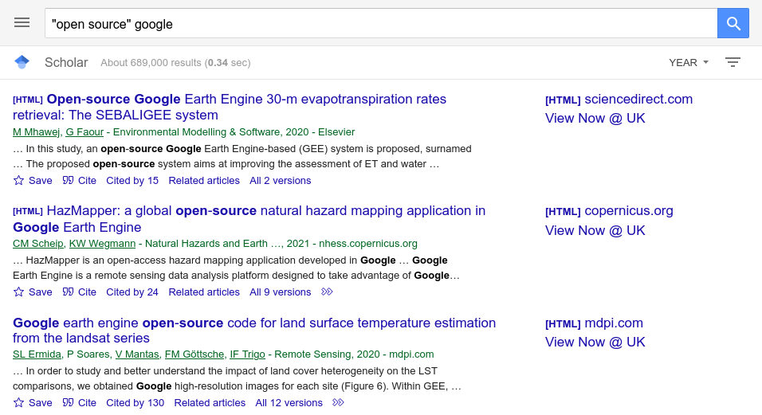
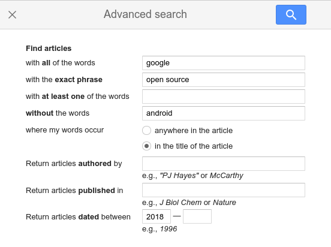
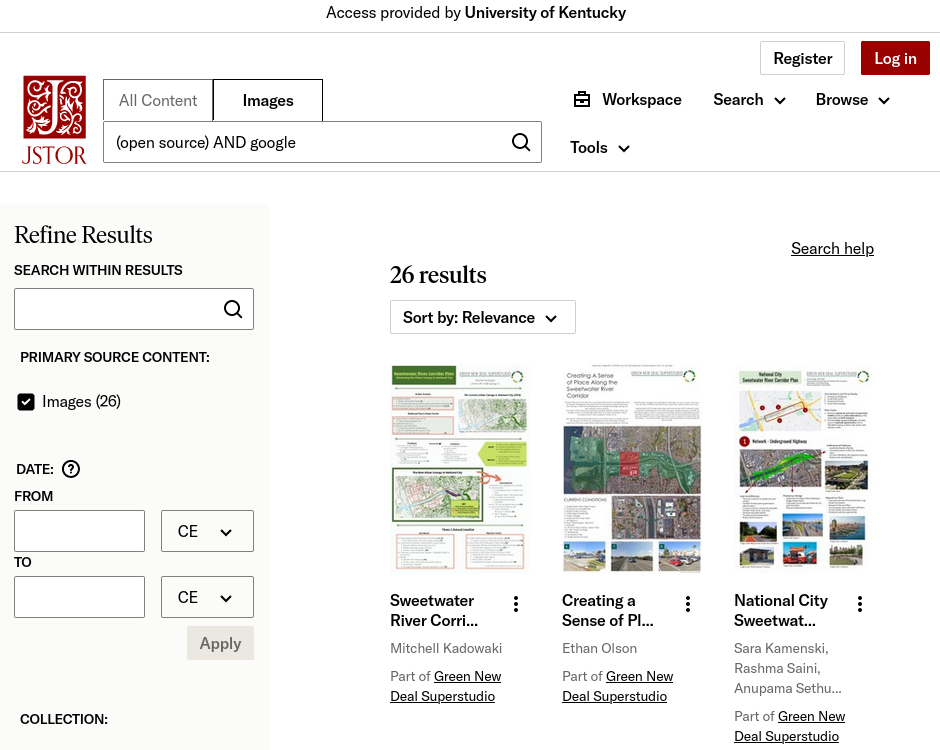

# Web Sources: Part 1

Many of us spend most of our time on the web
visiting a handful of sites.
These sites vary by country, but in the U.S.,
we spend much of our time on Google, YouTube,
Facebook, Twitter, Instagram, Netflix, TikTok,
Wikipedia, and a few others.

That's fine, of course, but
the web is composed of billions of web pages,
and many are worth knowing and exploring.

We also spend most of our time on a limited number of domains.
This includes sites ending with **.com, .org, .edu**, etc.
But remember that you've already learned how to search the web,
and if you're interested in learning more about what's out there,
I encourage you to add a ``:site`` operator to your web queries
if you want to vary things up every once in a while.
Remember that there nearly [1,500 top level domains][tld],
and it can be fun to add random ones to your searches:

```
asthma site:health
(linux or windows or macos) site:computer
```

That said, in this and the next section I want to cover a 
few specific sites that are great information resources.

## Google Scholar

Let's try [*Google Scholar*][google_scholar] now.
*Google Scholar* isn't technically a library database
since it's freely accessible on the web, but
I will show you how to connect it to Infokat so
that it functions like *WoS* or other databases that we've covered.

*Google Scholar* doesn't have the kind of search operators
that either *Factiva* or *Web of Science* have, but
it's a freely available citation database that indexes a lot of content.
In Google and related search products,
like *Google Scholar*, the **AND** operator does not
need to be specified.
Thus the following search is translated as:
**"open source" AND google**

<figure>

<figcaption>Fig. 5: <i>Google Scholar</i> search for "open source" google</figcaption> 
</figure>

You can see here we get a lot of results.
Maybe even too much.
If we want to limit our results,
we have to use other tricks.
The most common one is simply to add
more specific keywords to our query.
E.g., if I add "android" to the query,
that reduces the results.

```
"open source" google android
```

There is an advanced search option.
However, since *Google Scholar* is indexing full text sources
and not structured bibliographic records,
this means that it can't offer the kind of advanced
search we've seen in database searches.
It is pretty useful, though.
For example, Figure 6 shows an advanced search for the terms
**google** and **"open source"** but it 
excludes the term **android** in the title,
and it asks for results published from 2018 to today.
You can see that this substantially narrows our results.
As of August 1, 2022, *Google Scholar* returns only 35 hits
and 71 hits as of March 2024.

<figure>

<figcaption>Fig. 6: <i>Google Scholar</i> search for "open source" google not android in title</figcaption> 
</figure>

Other than that, one of the nice things about
*Google Scholar* is that it's also a citation database.
You can see the **Cited by N** link just below each result.
If something has been cited,
click on that to follow citations.

The reason *Google Scholar* returns so many more results is 
because it casts a bigger net than something like
*Web of Science* does,
which purposefully casts a smaller net,
which is smaller to control for quality.
Because of that, I find *Google Scholar* can return
many non-relevant works, but
it makes it nice for browsing or discovery. 
*Web of Science* shines for more
rigorous and methodical literature searches.

The observant among you may have noticed that in Figure 5,
there is a **View Now @ UK** link.
The reason *Google Scholar* provides that link is that
I've configured it to talk with UK's Infokat.
This is something you have to set up, but
it's pretty simple to do.
Just click on settings,
and then go to **Library Links**, and 
then search for the University of Kentucky.
Check the box next to it.
Be sure that you're signed into Google
if you want to save this as a preference. 
After that,
you should see the **View Now** option when something is 
available via UK Libraries.

<figure>

<figcaption>Fig. 7: <i>Google Scholar</i> View Now Setup</figcaption> 
</figure>

You might find the following three other web-based bibliographic tools useful:

- **Crossref** [https://search.crossref.org/][crossref]
    - *Crossref* will search all works that have a DOI, or [digital object identifier][doi]. As such, it contains many millions of bibliographic records.
- **Semantic Scholar** [https://www.semanticscholar.org/][semantic_scholar]
    - *Semantic Scholar* is an AI powered bibligraphic search engine that also functions as a citation database. It can provide summaries of articles and other works, lists of citations, citing authors, co-authors of authors, and links to related papers.
- **Consesus** [https://consensus.app/search/][consensus]
    - *Consensus* build on *Semantic Scholar*. Instead of a functioning like a traditional search engine, you can ask it questions on research topics. It provides examples on its main search page. It provide citation information and details about studies.

## Internet Archive

The [Internet Archive][archive] is a "non-profit library
of millions of free books, movies, software, music,
websites, and more."

For example, you might be interested in playing
some old PC games that your parents played
when they were younger:

[Classic PC Games][classPCgames]

The *Internet Archive* provides access to the [Wayback Machine][wayback].
The Wayback Machine is an archive of the web from its early days
to the present.
It's fun, for example, to use it to see what the web
looked like years ago.
For example, this is likely UK's first web page and
was captured by the *Wayback Machine* in 1997:

[http://www.uky.edu/ (1997)][uk1997]

But the *Wayback Machine* is also useful to retrieve
web pages and sites that have been shutdown or removed.
That is, if you have a broken URL,
you can enter the URL in the Wayback Machine and 
see if the original page was archived.

The *Internet Archive* is also a library, and
offers collections on a vast range of topics and links
to all sorts of media,
including text, audio, video, and images.

You can view its main collections on the
home page of the *Internet Archive*.
You can also search.
I've found, for instance, scanned yearbooks from my college.

The *Internet Archive* oversees [The Open Library][openlibrary].
You can use the *Open Library* to check out and read books for free,
just like you would use a physical library.

## DPLA

The [DPLA][dpla] (Digital Public Library of America)
is a shared repository of content
that brings together digital and digitized sources
from libraries, museums, and archives across the U.S.

The DPLA is great for browsing, but they also
[provide guides for those interested in using the DPLA][dplaUseCases]
for Education, Family Research, Lifelong Learning, and
Scholarly Research.

Like a library, museum, or archive,
the DPLA offers:

- featured [exhibitions][dplaExhibitions]
- [primary source sets][dplaprimary]
- the ability to [browse by topic][topicsDPLA]
- the ability to [browser by contributor][sourceDPLA]
- and more.

## Library of Congress

The [Library of Congress][locResearch] provides a list of
bibliographies, research guides, and finding aids
on a vast range of topics.
Many of the links in this list go directly to
digital libraries that focus on specific topics or areas.
For example, check out this fun collection of resources
on [dance manuals][locDance] published from 1490 through 1920.

The Library of Congress also provides access to
[digital collections][locDigital] on subjects ranging from 
**American History**, **War & Military**,
**Art & Architecture**, **Sports & Recreation**,
**Science & Technology**, and more.

## Various Government Resources

### U.S. Census

The [United States Census Bureau][uscensus] is the best
way to get various demographic and some economic 
information about the U.S.
You can also get [Quick Facts][quickFactsCensus]
about your local area.
You can, for example, also compare demographics by location.
Here's a
[population comparison between Lexington, KY and Cincinnati, OH][kyohCensus].

[quickFactsCensus]:https://www.census.gov/quickfacts/fact/table/US/PST045221
[kyohCensus]:https://www.census.gov/quickfacts/fact/table/cincinnaticityohio,lexingtonfayetteurbancountykentucky,US/PST045221

### NASA

[NASA's][nasa] website offers tons of sources on all
of its major projects.
From its homepage,
you can download apps, audio & ringtones,
e-books, and podcasts.
The site also provides information on various missions,
like the recent [James Webb Space Telescope][jameswebb]
as well as exciting [image][nasaImage] and
[video][nasaVideo] galleries.

### U.S. Bureau of Labor Statistics

The [U.S. Bureau of Labor Statistics (BLS)][bls] is the
go to site for job and economic information.
The site takes some exploration to learn all that it offers,
but I can provide two examples.

The Data Tools dropbox box provides employment change
data for various sectors of the U.S.
As of [March 2024][dataBLS], we see that manufacturing jobs
in the U.S. decreased by an estimated 4,000,
government jobs increased by an estimated 52,000, and
overall non-farm jobs increased by 275,000.

The [CPI Inflation Calculator][cpiBLS] shows how the value
of the dollar has changed over time.
For example, I can see that $1.00 in February of 2023
has the same buying power as $1.03 in February of 2024.

This calculator is useful in a lot of ways.
For example, the tuition to attend UK for the
[2002-2003 academic year was $1,740 per semester][uky2002], and for the
[2023-2024 academic year, it is $6,429][uky2023].
The CPI calculator shows that if tuition increased
at the same rate as inflation,
then today's tuition cost should only be $3,030.18 per semester
(from January 2002 to January 2024).
That means the extra $3,398.82 spent on tuition today increased
due to other (complicated) factors.

You can also see how home prices have changed.
The house I rent was purchased for $101,650
during the summer of 2001.
Zillow estimates that it would sell for $317,800 (Spring 2024).
But inflation only accounts for a price tag of $177,217.
Thus the extra $140,583 or so is factor of other market forces.

> Property information like this is generally public information.
> Fayette County, the seat of Lexington, KY, provides this information
> at [https://fayettepva.com/][fayetteProperty].
> You can check your local municipality's website for comparable information.
> In fact, many city and county websites make available lots of data.

### EDGAR: U.S. Securities and Exchange Commission

[EDGAR][edgar] is a go to site if you're thinking about investing
in a public company.
Of particular interest are the **10-K** and **10-Q** reports.
The **10-K** report is an annual report that public companies
are required to submit to the SEC.
The **10-Q** report is the quarterly version.

The **10-K** report:

> Provides audited annual financial statements,
> a discussion of material risk factors for the company and its business,
> and a management's discussion and analysis of the company's
> results of operations for the prior fiscal year
> ([Form Type Description][secForm])

The **10-Q** report is unaudited.

The [EDGAR search page][edgarSearch] is pretty straightforward
and offers autocomplete as you type.
My search query in Figure 1 is a search
for Google's (specifically, Alphabet's) last **10-K** report,
which was filed on February 2, 2022.

<figure>

<figcaption>Fig. 1: EDGAR Search for Alphabet Inc.</figcaption> 
</figure>

If you read the 2024 report,
you can see that *Google* primarily
earns income based on advertising,
customer subscriptions,
devices (e.g., Pixel),
and Google Cloud usage.
It's working on integrating AI technologies in its core services.
It has 182,502 employees.
There is much more in this report and
similar reports from other public companies.

## MedlinePlus 

Lastly, I would like to refer you to [MedlinePlus][medlineplus],
which is part of the National Library of Medicine.
The purpose of this site is to serve as a health and medical reference
resource for the general public.
Although no online site can take the place of professional medical help,
MedlinePlus can be an important resource for becoming more
informed about various health topics.

Instead of *googling* that next symptom or condition,
I highly encourage you to visit MedlinePlus first.
The site also covers wellness topics and provides recipes
for a wide range of meals.

## Conclusion

Although it's important to know how to search the web well,
it's also handy to know about specific go to resources on the
web that can provide more in-depth information or 
that provide more coverage than most Google etc searches can yield.
In order to highlight this, in this section I covered a few,
I think, super interesting and helpful sites that include the:

- Google Scholar
  - Crossref
  - Semantic Scholar
  - Consensus
- Internet Archive
- Open Library
- DPLA
- Library of Congress
- U.S. Census
- NASA
- U.S. Bureau of Labor Statistics
- EDGAR (SEC)
- MedlinePlus

Be sure to explore these sites, as well as others you find,
because many of these just don't come up in your everyday
kind of search.

[tld]:https://data.iana.org/TLD/tlds-alpha-by-domain.txt
[classPCgames]:https://archive.org/details/classicpcgames?and[]=subject%3A%22DOS+games%22
[archive]:https://archive.org
[wayback]:https://web.archive.org/web/
[uk1997]:https://web.archive.org/web/19970406042950/http://www.uky.edu/
[openlibrary]:https://openlibrary.org/
[dpla]:https://dp.la 
[dplaUseCases]:https://dp.la/guides
[dplaExhibitions]:https://dp.la/exhibitions
[dplaprimary]:https://dp.la/primary-source-sets
[google_scholar]:https://scholar.google.com
[topicsDPLA]:https://dp.la/browse-by-topic
[sourceDPLA]:https://dp.la/browse-by-partner
[locResearch]:https://www.loc.gov/rr/program/bib/index.html
[locDance]:https://www.loc.gov/collections/dance-instruction-manuals-from-1490-to-1920/about-this-collection/
[locDigital]:https://www.loc.gov/collections/
[uscensus]:https://www.census.gov/
[jameswebb]:https://www.nasa.gov/mission_pages/webb/main/index.html
[nasaImage]:https://www.nasa.gov/multimedia/imagegallery/index.html
[nasaVideo]:https://www.nasa.gov/multimedia/videogallery/index.html
[uky2002]:https://web.archive.org/web/20030101090559/http://www.uky.edu/PR/News/Archives/2001/Sept2001/02tuition.htm
[uky2023]:https://www.uky.edu/studentaccount/tuition-faq23-24
[bls]:https://www.bls.gov/
[dataBLS]:https://www.bls.gov/charts/employment-situation/otm-employment-change-by-industry-confidence-intervals.htm
[cpiBLS]:https://www.bls.gov/data/inflation_calculator.htm
[edgar]:https://www.sec.gov/edgar.shtml
[secForm]:https://www.sec.gov/oiea/Article/edgarguide.html
[fayetteProperty]:https://fayettepva.com/
[medlineplus]:https://medlineplus.gov
[nasa]:https://www.nasa.gov/
[edgarSearch]:https://www.sec.gov/edgar/search/
[semantic_scholar]:https://www.semanticscholar.org/
[consensus]:https://consensus.app/search/
[crossref]:https://search.crossref.org/
