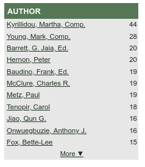
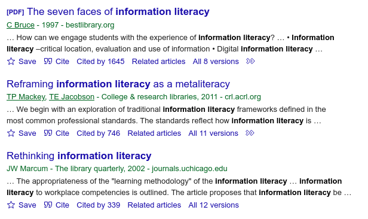
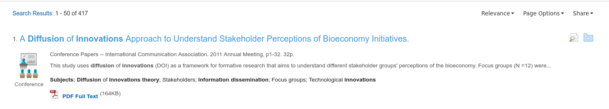

# Information Retrieval: Databases

I introduced the concept of databases in 
[section 3](3-information-sources-resources.html).
Databases, or sometimes bibliographic databases,
offer a number of unique advantages over search engines,
and some disadvantages, too.
The main advantages are that databases offer 
specialized collections on a variety of topic,
many sources that are invisible to search engines, and
greater control over the search process.
The main disadvantage is that they are a bit complicated to use well, 
there are many databases to choose from (and find),
each has their own user interface, and
they are often only accessible via a library.

Information retrieval (search) in databases works
similarly and differently than it does with the web.
Like in the web, information retrieval works on documents in a corpus.
We search that corpus using queries, and
how we construct our queries is important.

Documents in databases though are a bit different.
As discussed in the previous section,
while web pages on the web exist in a fairly organized hierarchy
(with respect to top level domains, etc.),
web pages themselves are not always very structured.
But search engines have become really good at taking
all that unstructured text and making sense of it.

Databases, on the other hand,
in particular, the ones we access through libraries,
generally index fairly structured documents:
i.e., bibliographic records.
They may also index full text documents if those
documents are accessible to the database.
If only bibliographic records are indexed,
the database is usually called an
**abstract and indexing database (A&I database)**.
Otherwise it's just called a full text database.
Many of the databases that we have access to at our
library are a mix of the two.
That is, some databases will include full text and also
only abstracts and other bibliographic information.

## Searching Bibliographic Records

By bibliographic information, I generally mean **metadata**,
and by bibliographic records,
I generally mean metadata about specific items.
Metadata is broadly defined as data about data,
or sometimes as information about information.
For example, a title of a book is metadata about a book. The author name of a journal article is
metadata about the journal article.
And so forth.
All the metadata about a specific item
(book, journal article, etc)
is a record.
In a database, this metadata is controlled,
and therefore, well structured.
As searchers, this basically means
that there are pre-set fields that 
we can search in these databases.
For example, in [Academic Search Complete (ASC)][asc],
we can search the following fields:

- Author
- Title
- Subject Terms
- Abstract text
- Author supplied keywords
- Geographic terms
- People (names)
- Journal Name
- ISBN

And more.
We can also filter by publication date, full text,
document type, language, number of pages, and images
(depending on the database and its content).
In the end, this means we have greater control over
the search process than we do in a search engine 
because the corpus is better defined.

For example, in the previous section,
I showed how we can search the web
by using the ``:filetype`` operator to limit results
to PDFs, DOCX, XLSX, etc files.
In a bibliographic database like ASC, however,
we can often specify that we want PDFs, but 
more importantly,
we can limit results by **document type**.
That means we can restrict results to items like:

- articles
- bibliographies
- book chapters
- book reviews
- case studies
- editorials
- film reviews
- interviews
- letters
- obituaries
- opinions
- poems
- recipes

And much more.

Otherwise, all the same principles apply to searching
databases as does searching the web with a search engine.
Specifically:

1. Text has primacy
2. Documents exist within a corpus
3. Query construction is important

And many of the same techniques apply, too:

1. We can use **quoting** to make sure words are included in the results
2. Term order matters
3. We can use **OR** between terms to focus on one term or the other or both
4. We can use other operators, like **NOT** and **AND**

> The **AND** operator between two query terms means
> that both terms must be present for each result in a search.
> For example, if I search for ``dogs AND cats`` in a database
> like ASC,
> then each result must include both the terms **dogs** and **cats**.
> We usually have to specify this **AND** in a database.
> This not the case with Google and other search engines.
> In search engines, the **AND** is assumed between terms.
> So the equivalent search in, for example,
> Google, Bing, DuckDuckGo, etc is simply ``dogs cats``.

## Subject Terms and Thesauri

Many (but not all) databases offer the ability
to search by subject or thesauri term.
Subject/thesauri terms are kinds of controlled vocabulary.
If a database uses these kinds of vocabulary terms,
it means that each record in the database includes a list of
these terms that should well describe the contents
of the item it describes.

For example, the *ASC* database uses subject terms.
One subject term is **Forest animals**, and
if I use that as my search query,
then each record that is returned
must include that subject term,
and that record should match the contents of the item.
I can peruse the results and identify other subject terms
that help narrow my results.
For example, the subject term **BIRD habitats** appears 
in records with the subject term **Forest animals**,
since records often have multiple subject terms.
If I combine those terms with an **AND** operator,
then I narrow my results down to two journal articles,
which is pretty precise.
ASC is a multi-disciplinary database, and
so feel free to explore subject terms related
to your own interests.

<figure>

<figcaption>Fig. 1: Academic Search Complete Results</figcaption>
</figure>

## Systematic Browsing

Although database search can be more precise
than searching in search engines,
they are also good for browsing.

We all browse
(online, in stores, as we page through books, and so on)
but as a type of search process,
browsing can become a highly useful tool
when applied systematically and strategically.
The result is not simply a way to scan through search results.
Rather, the result of intentional browsing,
(reading or skimming a list of titles and abstracts)
can be the accumulation of highly relevant source material,
relevant to our information needs and queries.

## Browsing Strategies

Although we make a distinction
between browsing and searching,
it is oftentimes helpful to begin
a browsing session with a keyword search,
and then use something from the search results,
something like an author's name or subject term,
to find and collect related information.
We call this type of browsing *pearl growing*.

## Pearl Growing: Subject Browsing

Below is an image of the [ERIC Database][eric] database.
*ERIC* stands for **Education Resources Information Center**.
The database is provided by the U.S. Department of Education and
is an important access point for millions of bibliographic
records to journal articles, books, research reports,
white papers, government and other
organizational reports, and more on education related topics.

<figure>

<figcaption>Fig. 2: The ERIC database</figcaption>
</figure>

*ERIC*, like other databases,
offers a thesaurus of controlled terms to help aid search.
For example, let's say I'm interested in research on academic libraries.
In this screen shot, I'm looking at the page that describes
the thesaurus **descriptor** for **academic libraries**,
and as is usual with thesauri,
it not only describes how the term is defined in the database,
but it also links to related terms,
including terms that are conceptually broader than academic libraries,
conceptually narrower than academic libraries,
or that are conceptually related to academic libraries.
I can click on any of these terms,
and then click on the link that says to
**Search collection using this descriptor**.
And in doing so, I engage in subject browsing.

<figure>

<figcaption>Fig. 3: Thesaurus descriptor page for the term academic libraries</figcaption>
</figure>

## Pearl Growing: Author Browsing

I can certainly browse using other access points,
like author names.
After perusing the results from above,
I can click on an author's name to narrow results.

<figure>

<figcaption>Fig. 4: Author names list covering academic libraries</figcaption> 
</figure>

Knowing that authors tend to write and research
on a specific range of topics (i.e., are specialists) is helpful
because it allows me to browse by author and subject topic.

## Pearl Growing: Citation Browsing

I've described abstracting & indexing (A&I) databases, but
there's another special type of A&I database called
a **citation database**.
Three useful ones available to us are

- [Scopus][scopus]
- [Web of Science][wos], and 
- [Google Scholar][GS] (more of a scholarly *search engine*).
  
The first two are available via UK Libraries,
and the latter is available freely on the web.
A citation database is a database that shows
who has cited an article (as known by their database)
and provides a link to those articles that have cited an article.
Citation theory says that when any two articles
(or books, or other documents) are cited in this way,
they are more likely to be about the same thing.
In fact, this is how Google search works, in part.
Google's original *Page Rank Algorithm* posited
that if a web page links to another web page,
then the two pages pages are likely to be about the same topic.
Because of this theory,
we can follow citations to find more relevant articles.

Pictured here is a record in *Web of Science* on information literacy.
To the far right you can see that it has **4 Citations**. 
If we click on that **4 Citations** link,
we can begin to browse those 4 articles or documents.
Per citation theory,
it's highly probable that those 4 citing documents
are also about information literacy;
and thus, browsing them would be of considerable
help if we were interested in reading more about information literacy.

<figure>

<figcaption>Fig. 5: WOS record of article on information literacy</figcaption> 
</figure>

After clicking on the **4 Citations** link,
we can see that the term **information literacy**
appears in the title of all four citing works.
This is good evidence for our citation theory.

<figure>

<figcaption>Fig. 6: Citing articles in WOS</figcaption> 
</figure>

*Google Scholar* works in much the same way.
Instead of *Times Cited*, it says *Cited by*,
and the search results default by generally listing (we think)
the most highly cited works rather than the most recent,
as is the default in *Web of Science*.
But if we click on the *Cited by* link,
we'll be taken to a page that lists
the citing articles and documents,
and like the *Web of Science* example,
it's likely that many of the citing articles
will be relevant in our search on this topic.

<figure>

<figcaption>Fig. 7: Cited by in Google Scholar</figcaption> 
</figure>

## Combination Browsing

Like with most other searches,
we can combine terms and use those combinations
to focus our browsing sessions.
The available combinations depend on the database we use.
Here's a screen shot of an item from the
*Communication & Mass Media Complete (CMMC)* database.
I searched this database using the thesauri term
*DIFFUSION of innovations* AND also
the term *regression* in the abstract.
Basically, this tells the database
to retrieve any record tagged with the thesauri term
*DIFFUSION of innovations* and
where also the term *regression* appears in the record's abstract.
If it contains regression in the abstract,
then the source likely used or refers to a statistical technique
called linear regression, logistic regression, or like.
Once I have this initial query,
I can begin browsing the 11 titles and
abstracts that are listed in the results.

<figure>

<figcaption>Fig. 8: Combination search in CMMC database">
</figure>

## Boolean Logic: AND, OR, NOT

Remember that database searching is more
structured at the document level, and
that this structure is reflected
in the ability to do field searches.
In the above example, for instance,
we use two fields.
The first field is a subject term search
for the subject **DIFFUSION of innovations**,
and it's marked as a subject field
with the **DE** at the beginning.
The second field is an abstract search,
and this is shown in the drop down box
to the right of the query term.
In between these two fields is a Boolean AND operator.
The AND operator tells the database that both
query terms must be present in the results.
We've seen this AND in prior examples.

I've mentioned two other Boolean operators:
**NOT** and **OR**.
Many bibliographic databases offer all three.
The **NOT** operator instructs the database
to exclude the assigned term.
Thus, if we had chosen **NOT "regression"**,
then the *CMMC* database would have 
returned results where the term **regression**
surely did NOT appear in the abstract for
records with the subject term **DIFFUSION of innovation**.

The **OR** Boolean operator is a bit tricky.
It means, basically, *one or the other or both*.
Thus, if we had used it here,
then *CMMC* would have returned all records
having the subject term **DIFFUSION of innovations**,
as well as those records that did or did not have
**regression** in the abstract.
The **OR** operator is more useful when querying
terms in the same fields.
For instance, we might want to use the **OR**
operator to search for two different terms 
that might appear in the abstract fields,
or the subject term fields,
such as the following related terms:

```
DIFFUSION of innovations theory" OR
INFORMATION dissemination"
```

We can see how this plays out in the results.
In the first record in the following screenshot,
both terms appear in the subjects list.
But in the second record,
only one of the terms appears.

<figure>

<figcaption>Fig. 9: Using the OR Boolean Operator</figcaption>
</figure>

## How to Browse

When we browse, therefore,
we are attempting to locate key qualities from our results
or our initial results lists (e.g., authors, subjects, etc.).
These lists include the titles, the abstracts, the thesauri,
and so forth.
And these key terms will help capture what our search is **about**.

## Developing a List

Many databases will offer a way to create,
save, and export lists or individual records
based on browsing and searching.
This helps us easily manage the documents that
we highlight as initially important.
We can curate these lists as they grow and
our search becomes more focused.

Creating a list in a specific database
usually requires us to create an account on
that database.
I already have an account with EBSCOhost,
the vendor that provides the *CMMC* database
as well as many others, and
in the following screenshot,
I've already signed in to that account.
To the right of the image,
you can see a folder icon.
As I browse through records that look
relevant to my needs,
I can click on that icon and save
the result to a folder.
I can also create multiple folders
and email, download, or print the records
for later use.

<figure>

<figcaption>Fig. 10: Using Folders to Save Records</figcaption>
</figure>

Of course, alternatively, I prefer to save records
in Zotero rather than use a database folder or list.
This way I keep the records with me even if I lose
access to the database.

## Conclusion

In this section, we learned the following:

- Databases and search engines are different
- Each have advantages and disadvantages
- Search engines are well structured at the file system level
- Databases are well structured at the record level
- Searching in a database means search structured bibliographic records
- Records are structured by pre-set fields
- Subject terms or thesauri descriptors help create precise searches
- Systematic browsing can be a rigorous way to engage in search
- Pearl growing is a browsing strategy that involves collecting items
  based on an initial aspect of a bibliographic record. Such as as:
    - subject term
    - author name
    - citation
- Because databases search structured bibliographic records with pre-set
  fields, we can create very precise queries by combining fields
- We can combine fields using Boolean logic: AND, OR, NOT
- We can create and save lists as we browse
- Or we can save items to our reference manager (RM).

In the end, don't simply browse absentmindedly.
Rather, browse with smarts: systematically and strategically.
Make the systems work for you.
And save your results in Zotero or your
chosen RM as you go.

[eric]:https://eric.ed.gov/
[scopus]:https://libguides.uky.edu/3347
[wos]:https://libguides.uky.edu/467
[GS]:https://scholar.google.com/
[asc]:https://libguides.uky.edu/4
