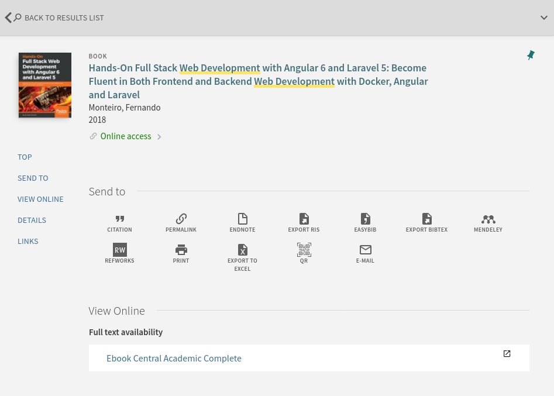

# Library Sources: Part 1

## Readings

Please review the aspects of Infokat searching here:

- Naas, D. (n.d.). Research Guides: InfoKat Discovery: Getting Started.
  Retrieved August 3, 2022, from [UK LibGuides][infokatLibGuide].

## Introduction

We have already discussed
[database information retrieval](6-database-information-retrieval.html).
In this section we're going to explore a bit more
the places where we can apply that knowlege.
Specifically,
UK Libraries provides access to many millions of sources
that include books (ebooks and print books),
databases, journals, archival works, image collections,
multimedia collections, and more.

In this and the next,
I'll focus on two of the most common usages of the library's resources:

- Infokat: for searching books and also database offerings
- Databases: for searching specific database offerings 
  
However, it's worth your time to explore the UK Libraries' website
in order to learn what you have access to.
Or even, you could use Google's ``:site`` operator
to locate resources of interest that the library provides:

```
[something of interest] site:libraries.uky.edu
```

## Infokat

*Infokat* is short for [Infokat Discovery][infokatD], and

> is the primary search tool for browsing
> and finding materials from UK Libraries' collections,
> and a great place to begin your research.
> Infokat searches our libraries' physical holdings
> together with a majority of the
> individual databases to which we subscribe
> [About Infokat][aboutInfokat].

In short, it's the modern equivalent of an
online card catalog system, but
because it's modern,
it's much more than that.
Not only can Infokat locate books on the shelves
at W.T. Young or at the other [library locations at UK][uklibLocations],
Infokat is also good for discovering digital collections,
database resources, and more.
And if the library doesn't have a source,
Infokat can facilitate an interlibrary loan request.
Although interlibrary loans mean that we
won't get immediate access to the requested source,
it's often very fast.
In my experience,
I usually receive PDF copies of 
requested journal articles within 24 hours,
and for many books that I've requested through interlibrary loan,
I generally receive copies within one to three days. 

Infokat also works well with Zotero and
other reference management software.
I'll cover that in a follow up demonstration video.

## Searching Infokat

There are two initial ways to search Infokat:

- Basic search
- Advanced search

Basic search works just like how you would use
Google or some other search engine.
You enter a query into the search box and press enter.

However, because the **corpus** you're querying is structured,
like a database,
it's not necessarily advisable to use *natural language*
for your queries like you might in a web search engine.
Remember that our queries should always consider the
corpus we're searching.
This means you should devise queries that highlight
the subject matter.
You can do this by picking one or more keywords
for your queries that express the topic
that you're interested in retrieving.
Also, because the corpus you're searching in Infokat is structured,
advanced search offers fine-tuned, precision search
functions that let us search by specific fields,
dates, and includes Boolean logic.

### Basic Search

Basic search is a great place to start your research,
especially when starting on a new project.
From there you can use hints that you see in your retrieval
results to practice *pearl growing* or
to refine and narrow your search results.

<figure>

<figcaption>Fig. 1: Infokat basic search</figcaption> 
</figure>

You can apply *pearl growing* by noticing title information,
subject terms, publication information, or more and
as a way to follow up on leads/hints you find in the results you retrieve.
You can also refine results by availability, resource type,
subject heading, language, and more.

Like web search engines,
term order matters.
Therefore, you should enclose queries in double quotes in order
to force Infokat to return results using the exact 
terminology and to return results in the same order as your terms. 
For example, if my query is:

```
web development
```

Then results will include titles like:

```
Development of a web tool to ...
```

But if I wrap my query in quotes, like so:


```
"web development"
```

Then results will literally reflect those terms and in that order.
For example:

```
Hands-On Full Stack Web Development with Angular...
```

### Advanced Search

Advanced search in Infokat provides a form
where you can focus on constructing precise queries.
You can apply a variety of search filters that 
limit queries to specific fields in the structured data,
such as title information, author/creator information, and subject terms.

<figure>

<figcaption>Fig. 2: Infokat advanced search</figcaption> 
</figure>

Instead of using double quotes to force results to match your query,
you have other options.
These include the ability to state whether the search results should 
contain the terms in your query, match exactly the terms in your query,
which is like using double quotes, or
whether the search results should start with the same terms
as your query.

You can also use Boolean logic in advanced search.
This is especially helpful as you refine your queries.
For example, if you're interested in web development
but not interested in "embedded web development",
you can use the Boolean **NOT** to removed retrieved records that
contain the word "embedded" from the results.
You can also limit results by time period (publication date)
in order to focus on either historical works or recent works.

If you're using Zotero and the browser add-on,
you will see a folder icon in your browser bar
when you're on the result page.
This will let you save multiple items to your Zotero
library or to a specific Zotero folder in your library.

## Record Page

When you find a result that interests you,
click on the link to get more information and
do more with the result.
From here you can save the specific item to Zotero,
but Infokat let's you export citations manually, too.
You can have the item emailed to you, or print it out,
and more.

If the item is available as a print item,
Infokat will tell you where in the library it's located
(i.e., shelf and floor), and
it will also tell you which library the book is located,
since UK Libraries has many locations aside from W.T. Young.
If the item is not available electronically or in print 
at one of the UK Library locations,
this is where you can request the items via interlibrary loan.

When you sign in via your linkblue information,
you can request the item directly, and if you have 
loans out, you can request that they be renewed.

<figure>

<figcaption>Fig. 3: Infokat record page</figcaption> 
</figure>

## Conclusion

UK Libraries provides access to millions of items
in both digital and print versions.
In this section, I focused on accessing their collections
using Infokat Discovery,
and we focused on using Basic and Advanced Search.

It's fine to know the basics of a technology like Infokat,
but it's another level to integrate this technology into your workflow.
In order to do that,
you should use Zotero, or your reference manager of choice,
to save items to you Zotero library.
As you save items,
return to them, read them, and take notes on them.
This process will become streamlined and feel natural over time,
and eventually you'll have amassed your own personal knowledge repository.

In the next section, I'll focus on specific databases
that UK Libraries provides access to for more topical searches.


[infokatD]:https://saalck-uky.primo.exlibrisgroup.com/discovery/search?vid=01SAA_UKY:UKY
[aboutInfokat]:https://libraries.uky.edu/find-borrow/where-do-i-start
[uklibLocations]:https://libraries.uky.edu/locations
[infokatLibGuide]:https://libguides.uky.edu/c.php?g=457383&p=3126835
